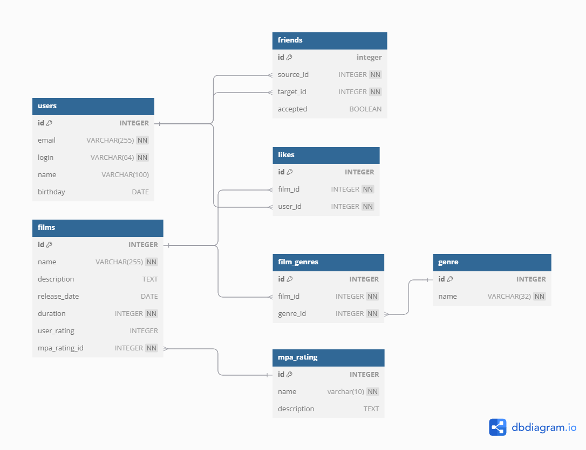

# java-filmorate
Проект Filmorate

## Структура БД

## GET запросы

Получение перечня всех фильмов  
GET /films

    SELECT * FROM films;

Получение списка из {count} наиболее популярных фильмов  
GET /films/popular?count={count}

    SELECT * FROM films ORDER BY user_rating DESC LIMIT {count};

Получение перечня всех пользователей  
GET /users

    SELECT * FROM users;

Получение списка подтвержденных друзей пользователя {uid}  
GET /users/{id}/friends

    SELECT target_id 
    FROM friends
    WHERE source_id={id} AND accepted
    UNION
    SELECT source_id
    FROM friends
    WHERE target_id={id} AND accepted;

Получение списка общих друзей пользователей {id} и {otherId}  
GET /users/{id}/friends/common/{otherId}

    (SELECT source_id FROM friends
    WHERE accepted AND target_id={id}
    UNION
    SELECT target_id FROM friends
    WHERE accepted AND source_id={id})
    INTERSECT
    (SELECT source_id FROM friends
    WHERE accepted AND target_id={otherId}
    UNION
    SELECT target_id FROM friends
    WHERE accepted AND source_id={otherId});

## Другие запросы

Получение всех фильмов с рейтингом 'PG-13' 

    SELECT films.name
    FROM films INNER JOIN mpa_rating ON films.mpa_rating_id=mpa_rating.id
    WHERE mpa_rating.name = 'PG-13';

Рейтинг пользователей, голосовавших чаще других

    SELECT users.name, Count(film_id) AS film_count
    FROM users INNER JOIN likes ON users.id = likes.user_id
    GROUP BY users.name, likes.user_id
    ORDER BY film_count DESC
    LIMIT 5;
